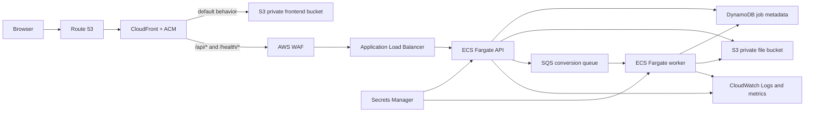

# DataForge AWS Deployment

This plan targets a production-ready AWS deployment managed with Terraform. It does not require AWS credentials until the infrastructure validation milestone.

## Target Architecture

CloudFront is the only public application origin. It serves static frontend files from S3 and forwards API paths to the load balancer. The browser therefore calls relative `/api` URLs, and the anonymous guest cookie remains first-party.

## Why These Services

| Concern                | AWS service       | Reason                                                                                              |
| ---------------------- | ----------------- | --------------------------------------------------------------------------------------------------- |
| Frontend assets        | S3 + CloudFront   | Low-cost static hosting, TLS, caching, and one public origin                                        |
| API process            | ECS Fargate + ALB | Fits the existing Express server and native `better-sqlite3` dependency without a Lambda rewrite    |
| Uploaded/result files  | S3                | Durable files survive task replacement and do not depend on container disks                         |
| Job and batch metadata | DynamoDB          | Durable owner-scoped records with expiry through TTL                                                |
| Conversion dispatch    | SQS               | Durable retries and separation between HTTP latency and conversion work                             |
| Conversion worker      | ECS Fargate       | Supports large files, Excel parsing, SQLite generation, and longer processing than request handlers |
| Secrets                | Secrets Manager   | Keeps signing secrets out of Terraform state, images, and frontend assets                           |
| Edge protection        | AWS WAF           | Distributed request limits and common managed protections                                           |
| Logs and alarms        | CloudWatch        | Collects the structured JSON events already produced by the application                             |

## Current Deployment Blockers

The current backend cannot safely run as multiple disposable tasks:

- job and batch metadata is stored in local JSON files;
- uploads and results are stored on the local filesystem;
- conversion work is scheduled with in-process callbacks;
- an API process restart can interrupt queued work;
- multiple API processes would have independent rate-limit counters and competing JSON state.

Containerizing this implementation without replacing those boundaries would create a demo deployment, not the production-ready path selected for this project.

## Incremental Milestones

### 1. Storage and Queue Contracts

Define interfaces for job metadata, batch metadata, source/result objects, and conversion dispatch. Keep local filesystem/JSON/in-process implementations as the default adapters.

Progress:

- [x] 1A: asynchronous job and batch metadata repository contracts with local JSON adapters;
- [x] 1B: asynchronous source/result object-storage contract with a local filesystem adapter;
- [x] 1C: asynchronous conversion dispatch contract with a local in-process adapter.

`backend/src/dependencies.ts` is the composition point that selects repository, object-storage, and conversion-dispatch adapters. Controllers and services consume the contracts instead of importing JSON stores, persistent filesystem paths, or an in-process scheduling mechanism. These operations are asynchronous even though the local implementations are not remote, because DynamoDB, S3, and SQS access will be asynchronous.

Metadata now stores relative object keys instead of absolute server paths. The local repositories normalize existing path-based JSON records when loading them, preserving retained local artifacts across the migration. Downloads are streamed through the object-storage contract. Multipart uploads and SQLite generation may still use short-lived operating-system temporary files, but persistent sources and results are owned by the selected object-storage adapter.

Conversion submission now uses identifier-only commands for job conversion, batch analysis, and batch conversion. The local dispatcher preserves deferred in-process execution; a future SQS adapter can publish the same commands without receiving guest tokens, file contents, or repository records. Readiness reports the selected dispatcher provider and health.

Why first: service and controller behavior can remain stable while AWS adapters are introduced later. Local development and all existing tests continue to work without AWS.

Acceptance checks:

- no service imports a concrete JSON repository directly;
- no service assumes a local source/result path;
- no service schedules conversion work directly;
- current unit and smoke tests pass with local adapters.

### 2. Worker Boundary

Move conversion execution behind explicit job and batch commands that can run in a separate process. Add idempotency and retry-safe status transitions.

Why: SQS can deliver messages more than once, and an ECS worker may stop during processing.

Acceptance checks:

- duplicate commands do not produce conflicting results;
- failed commands can be retried safely;
- API startup does not resume work through process-local callbacks;
- a local queue adapter still supports development.

### 3. AWS Adapters

Implement S3 object storage, DynamoDB metadata repositories, and SQS dispatch behind the contracts from milestones 1 and 2. Test them against local emulation or isolated integration resources.

Why: application behavior should be verified before Terraform creates the full public stack.

Acceptance checks:

- owner-scoped lookups remain enforced;
- DynamoDB TTL uses the existing 24-hour expiry;
- S3 objects are private and expire through lifecycle rules;
- messages contain identifiers, not guest tokens or uploaded contents.

### 4. Container Images

Create separate multi-stage images for the API and worker. Run as non-root, expose only the API port, add graceful shutdown, and verify liveness/readiness behavior.

Why: Terraform should deploy tested immutable artifacts rather than build application code itself.

Acceptance checks:

- images build on Node.js 22;
- API and worker run locally from images;
- SIGTERM stops new work and completes or safely returns active work;
- container filesystems are treated as disposable scratch space.

### 5. Terraform Foundation

Create versioned Terraform modules for networking, ECR, S3, DynamoDB, SQS, ECS, ALB, IAM, Secrets Manager references, and CloudWatch log groups. Start with a development environment.

Why: credentials and account details become necessary only when planning or applying real resources.

Acceptance checks:

- `terraform fmt` and `terraform validate` pass locally;
- `terraform plan` contains no plaintext secret values;
- IAM policies are scoped to specific queues, tables, buckets, and secret ARNs;
- deletion protection and retention choices are explicit per environment.

### 6. Frontend and Single-Origin Routing

Upload the Vite build to a private S3 bucket and configure CloudFront behaviors for static assets, `/api/*`, and `/health/*`. Add ACM and DNS when a domain is available.

Why: the same-origin route preserves the current cookie and CSRF model and avoids a public API hostname in frontend configuration.

Acceptance checks:

- direct S3 access is blocked;
- SPA routes fall back to `index.html` without masking missing assets;
- API responses are not cached;
- fingerprinted frontend assets use long immutable caching.

### 7. Deployment Pipeline

Extend GitHub Actions with image build/push, Terraform plan, protected apply, frontend upload, and CloudFront invalidation. Authenticate through GitHub OIDC rather than long-lived AWS keys.

Why: deployments should be repeatable and auditable without storing AWS credentials in GitHub secrets.

Acceptance checks:

- pull requests run validation and Terraform plan only;
- production apply requires an approved GitHub environment;
- GitHub can assume only the deployment role;
- application tasks use separate runtime roles.

### 8. CloudWatch and Production Gates

Create metric filters, dashboards, alarms, retention rules, WAF limits, backup/recovery checks, and a cost budget. Run browser and conversion smoke tests against the deployed URL.

Why: a successful resource deployment is not yet an operable production service.

Acceptance checks:

- API 5xx, conversion failures, queue age, task health, and readiness alert correctly;
- request IDs connect API and worker events;
- restore and rollback procedures are documented and tested;
- AWS Budget alerts are enabled before routine use.

## Information Needed Later

No account details are needed for milestones 1 and 2. Before the first real Terraform plan, collect:

- AWS account ID and authenticated CLI/profile;
- target region;
- development and production naming convention;
- domain and DNS ownership, if available;
- monthly budget threshold and log-retention requirements;
- who may approve production deployments.

Never place AWS credentials, signing secrets, or generated Terraform state in Git. Remote Terraform state will use a private encrypted S3 bucket with locking once the target account is known.
