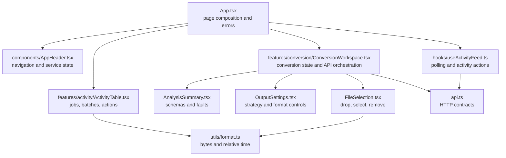
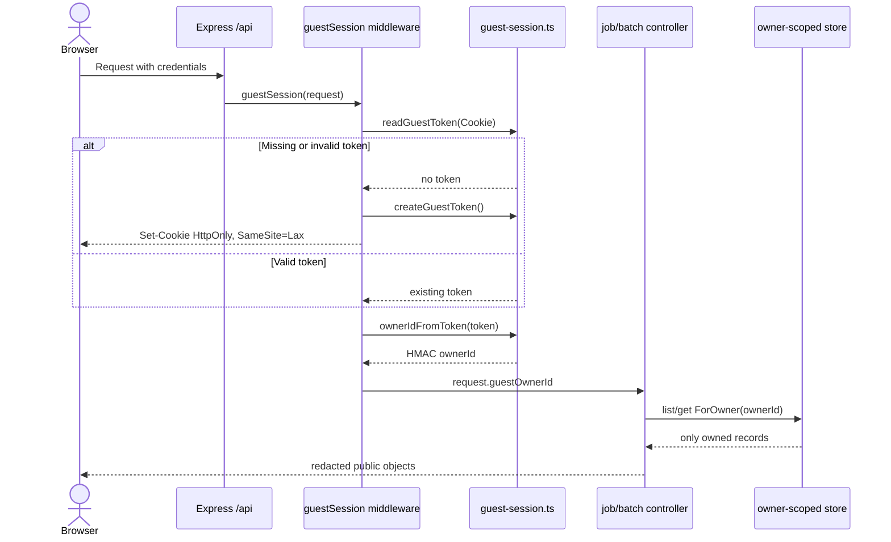
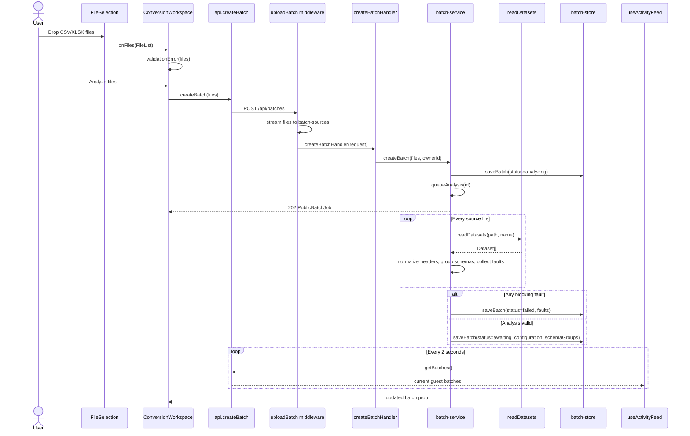
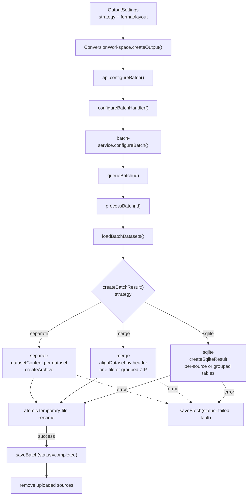
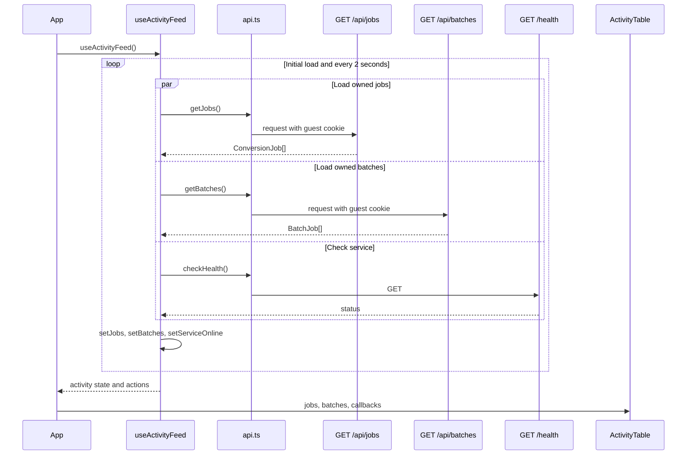
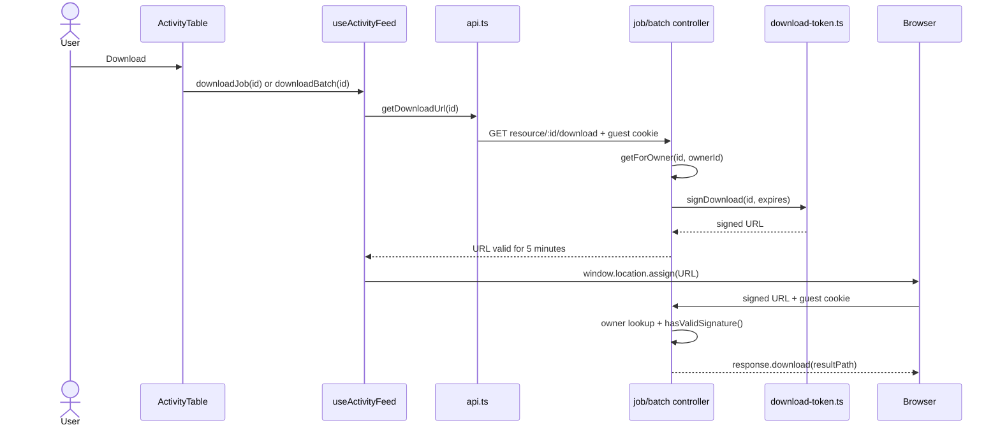
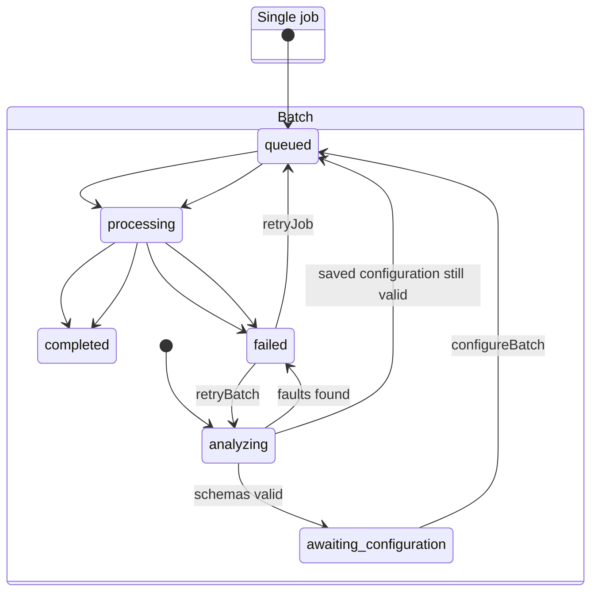
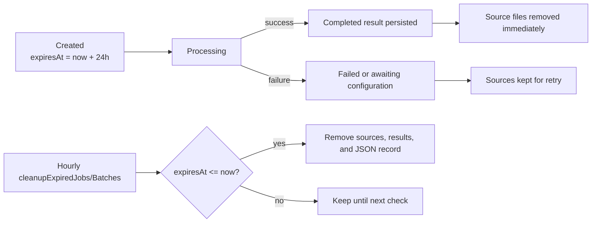

# DataForge Workflows

This guide explains the application by following objects through modules and functions. Start with the frontend map, then open the diagram for the feature you are changing.

## Frontend Modules

`App.tsx` decides which page is visible and connects feature callbacks. Feature state belongs in the feature module; transport details belong in `api.ts`; display-only transformations belong in `utils`.

## Guest Identity

Every API object belongs to one anonymous browser. The raw guest token is never stored in a job or returned in JSON.

Key functions:

- `guestSession()` creates or refreshes the cookie and sets `request.guestOwnerId`.
- `ownerIdFromToken()` derives the persisted owner identifier.
- `listJobsForOwner()`, `getJobForOwner()`, `listBatchesForOwner()`, and `getBatchForOwner()` enforce isolation.
- `toPublicJob()` and `toPublicBatchJob()` remove owner IDs and server paths.

## Batch Analysis

Uploading files does not immediately choose an output. The first stage scans every CSV/workbook and returns schemas or all detected faults.

## Output Configuration and Processing

The scan result determines the labels shown by `OutputSettings`, but the user still explicitly chooses the output strategy.

The final path is assigned only after a temporary result is complete. This prevents a partial archive, merged file, or database from becoming downloadable.

## Activity Polling and History

## Download

Downloads require both the owning guest cookie and a short-lived HMAC signature.

Another guest receives `404` even if they obtain the signed URL.

## Retry and Recovery

At server startup, `initializeJobs()` returns queued/processing jobs to `queued`, and `initializeBatches()` resumes analyzing or configured work. Retries keep the original `expiresAt`; they do not create a new 24-hour window.

## Retention and Cleanup

Downloads and retries do not extend expiry. Clearing the guest cookie makes existing records inaccessible to that browser, but normal cleanup still removes them at their deadline.

## Legacy Single-File API

The current conversion screen uses the batch workflow even for one selected file. The single-job API remains available for compatibility and appears in the shared activity table.

```mermaid
flowchart LR
    Post["POST /api/jobs<br/>createJobHandler"]
    Create["job-service.createJob"]
    Store["saveJob queued"]
    Queue["queueJob"]
    Convert["conversion-service.convertJob"]
    Read["dataset-service.readDatasets"]
    Result["CSV / TSV / JSON / ZIP"]
    Complete["saveJob completed"]
    Cleanup["remove source"]

    Post --> Create --> Store --> Queue --> Convert --> Read --> Result --> Complete --> Cleanup
```

## Keeping This Guide Current

Update this document when any of these change:

- a route is added or removed;
- a job or batch state transition changes;
- ownership, signing, retention, or cleanup behavior changes;
- a frontend responsibility moves between modules;
- a new output strategy is introduced.

Diagrams should name the function that decides behavior, not every helper it calls. That keeps them useful without duplicating source code line by line.